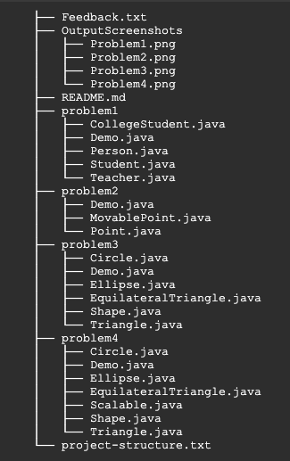
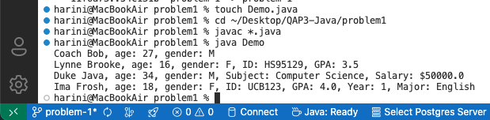
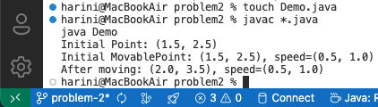
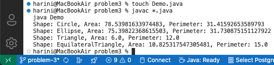
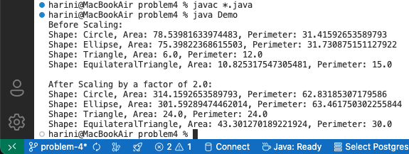

# QAP3 Java Assignment - Harini Manohar
## Date: 13-Mar-2025

This repository contains the solutions for **QAP 3 (Quantitative Assessment Practice 3)** for **Advanced Java Programming**. The assignment focuses on Object-Oriented Programming concepts like **inheritance, abstraction, interfaces, and polymorphism**.

---

## 🗂️ Project Structure

---

## ✅ How to Run the Code

### Requirements:
- Java JDK (version 17 or above)
- Command-line or terminal access

### Steps to Run:
1.  Navigate to the specific problem folder, e.g., `problem1`:
    cd problem1
2.  Compile the Java files:
    javac *.java
3.	Run the demo program:
    java Demo
#### Repeat this for each problem folder (problem2, problem3, problem4).

---

## 📸 Output Screenshots

Here are the output screenshots for each problem:

- **Problem 1:**  
  
- **Problem 2:**  
  
- **Problem 3:**  
  
- **Problem 4:**  
  

---

## ✅ GitHub Workflow Highlights:
•	Branching: Each problem was implemented in its own branch.
•	Commits: Regular, descriptive commits were made throughout the project.
•	Pull Requests: Each branch was merged via a PR to maintain a clean history.
•	.gitignore: .class files and unnecessary system files were ignored to keep the repository clean.

---

## 📄 Feedback and Reflection:

- [View Feedback and Reflection Responses](Feedback.txt)for detailed answers regarding the assignment experience.

---

## 🤝 Contribution and Collaboration
•	No external collaboration was required apart from utilizing online resources and lecture materials.
•	All work was independently completed following best practices.